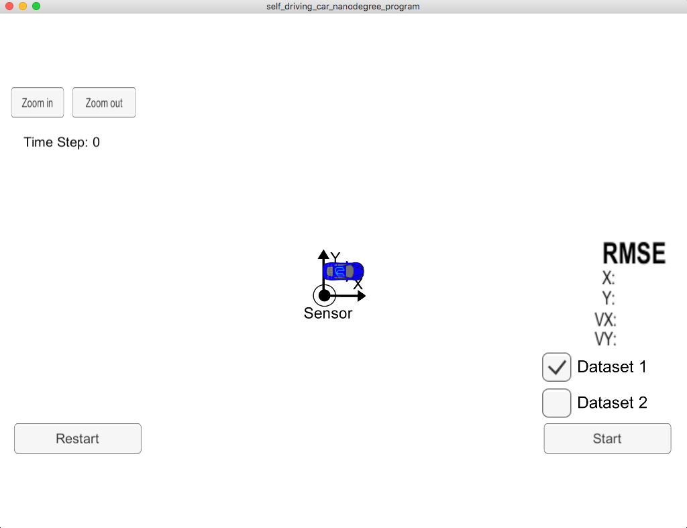
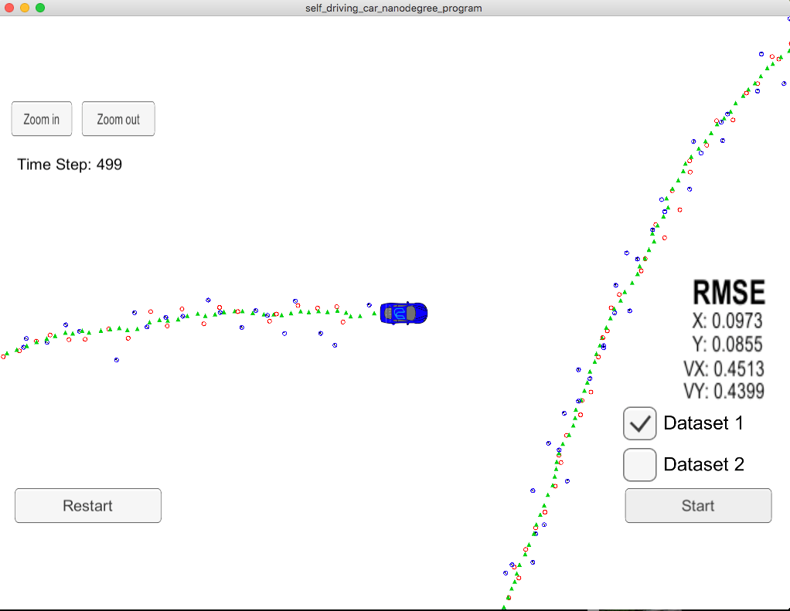

# CarND-Extended-Kalman-Filter-P1
Udacity Self-Driving Car Nanodegree - Extended Kalman Filter Implementation

# Overview
This project consists of implementing an [Extended Kalman Filter](https://en.wikipedia.org/wiki/Extended_Kalman_filter) with C++. A simulator provided by Udacity ([it could be downloaded here](https://github.com/udacity/self-driving-car-sim/releases)) generates noisy RADAR and LIDAR measurements of the position and velocity of an object, and the Extended Kalman Filter[EKF] must fusion those measurements to predict the position of the object. The communication between the simulator and the EKF is done using [WebSocket](https://en.wikipedia.org/wiki/WebSocket) using the [uWebSockets](https://github.com/uNetworking/uWebSockets) implementation on the EKF side.
To get this project started, Udacity provides a seed project that could be found (here)(https://github.com/udacity/CarND-Extended-Kalman-Filter-Project).

# Prerequisites

The project has the following dependencies (from Udacity's seed project):

- cmake >= 3.5
- make >= 4.1
- gcc/g++ >= 5.4
- Udacity's simulator.

## Running the Filter

From the build directory, execute `./ExtendedKF`. The output should be:

```
Listening to port 4567
Connected!!!
```

As you can see, the simulator connect to it right away.

The following is an image of the simulator:



The simulator provides two datasets. The difference between them are:

- The direction the car (the object) is moving.
- The order the first measurement is sent to the EKF. On dataset 1, the LIDAR measurement is sent first. On the dataset 2, the RADAR measurement is sent first.

Here is the simulator final state after running the EKL with dataset 1:



Here is the simulator final state after running the EKL with dataset 2:


# [Rubric](https://review.udacity.com/#!/rubrics/748/view) points

## Accuracy

### px, py, vx, vy output coordinates must have an RMSE <= [.11, .11, 0.52, 0.52] when using the file: "obj_pose-laser-radar-synthetic-input.txt which is the same data file the simulator uses for Dataset 1"

The EKF accuracy was:

- Dataset 1 : RMSE <= [0.0973, 0.0855, 0.4513, 0.4399]
- Dataset 2 : RMSE <= [0.0726, 0.0965, 0.4216, 0.4932]


